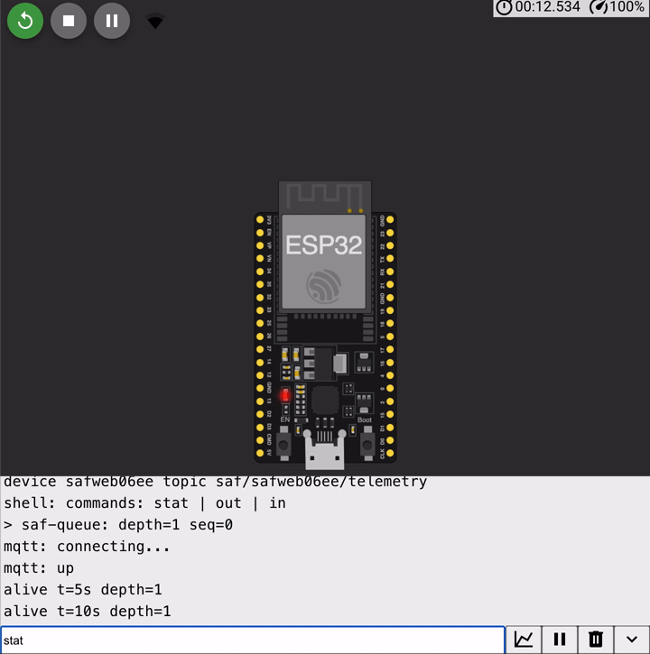

# mqtt-store-and-forward

An ESP32 (ESP-IDF v5.3 / FreeRTOS) publishing MQTT telemetry over deliberately broken
connectivity — broker SIGKILLed, link cut mid-PUBLISH, device rebooted mid-outage,
power cut mid-flash-write — with **zero loss and zero duplicates after dedup**,
asserted downstream in CI.



## Run it in your browser

**[Wokwi project](https://wokwi.com/projects/474963979580769281)** — an honestly-labeled
Arduino-core port (browser Wokwi can't compile ESP-IDF): same engine rules, RAM queue
instead of NVS, real MQTT to `test.mosquitto.org` through the browser gateway. Type
`stat`, then `out` (watch the queue build), then `in` — and wait for the firmware's own
verdict: `saf: drained, nothing lost`.

Locally:

```sh
make -C test          # unit suite + 100% branch gate on the engine (~2 s, needs cc)
make -C test chaos    # the full chaos suite (needs mosquitto + pip paho-mqtt)
idf.py build          # the firmware, ESP-IDF v5.3
```

## What this demonstrates

- **At-least-once vs exactly-once, done honestly**: QoS 1 + idempotent
  `<device>-<seq>` message IDs + downstream dedup, instead of QoS 2 — and
  [why](docs/protocol-choice.md). The chaos suite manufactures a real broker-side
  duplicate (a swallowed PUBACK) and proves the pair: without dedup the consumer sees
  it; with dedup the verdict is clean.
- **A persistent NVS queue with a wear-aware write pattern**: one blob per advancing
  key, erase-after-PUBACK, sequence numbers leased in blocks of 32 so reboots can skip
  but never reuse. The [erase-cycle arithmetic](docs/nvs-queue.md): ~10.7M messages on
  the default 24 KB partition vs ~600 k for the rewrite-one-blob layout it replaces.
- **Torn-write detection that provably fires**: the host storage fake half-writes a
  record, 0xFF-fills the tail and `_exit()`s *inside the write*; recovery must drop
  exactly that record — and the control run (CRC check stubbed out) must publish the
  garbage and fail downstream, or the detector's green means nothing.
- **Exponential backoff with jitter + session resumption**: equal-jitter windows
  500 ms → 60 s, reset on success, unit-tested at the arithmetic level;
  `clean_session=false` and what `session present` actually buys a publisher.
- **Injected-interface architecture**: the engine (`main/saf_core.c`) is pure C — no
  IDF includes. The chaos suite runs the same file on the host against real mosquitto;
  the firmware binds it to NVS + esp-mqtt. The authoritative acceptance never touches
  a simulator.

## The bug gallery

What the harness caught while this was built — the evidence, not the war story:

- **The branch gate refused an untestable recovery path.** `saf_init` re-read the
  newest record to resume the sequence — a read that could not fail in any reachable
  state, so its failure branch was dead code. gcov's 96.5% would not budge until the
  recovery loop *captured* the sequence it had already decoded instead of re-reading
  it (`saf_core.c`, the `have_newest` capture). Coverage gaps in pure logic are design
  feedback, not test debt (02's lesson, still paying out).
- **"Missing tail" tests can silently test nothing.** The first version of the
  recovery-trim test deleted the tail record — and passed vacuously, because the
  store's *scan* already excluded the deleted key; the trim path it claimed to test
  never ran. The fixed test makes the store list a key it then refuses to read
  (`test_saf.c: test_recovery_trims_unreadable_tail`). A test that passes before the
  code exists is the control you forgot to run.
- **CI's first run refused a real out-of-bounds risk clang had waved through.**
  GCC 13's `-Warray-bounds` (fortified `memcpy`) rejected the hand-rolled MQTT
  CONNECT encoder: the client-id length was unbounded on entry, so the frame buffer
  provably *could* overflow even though no caller ever passed a long id. The fix
  bounds every externally-sized input at the encoder boundary
  (`test/mqtt_mini.c`) — the compiler was right and "no caller does that" is not a
  bounds check. Same run: glibc hides `usleep`/`srandom` behind `_DEFAULT_SOURCE`,
  which macOS had silently forgiven.

## How it is tested


- **Unit + branch gate**: the engine's mock-driven suite; every branch in
  `saf_core.c` taken both ways (100.00%, gated in CI).
- **Chaos suite** (host, real mosquitto, cuttable TCP proxy): healthy · broker
  SIGKILL + restart · PUBLISH cut mid-frame · PUBACK swallowed · device SIGKILL
  mid-drain, mid-outage · power-cut torn write. After every scenario the
  **subscriber** (paho — deliberately not the code under test) prints the verdict CI
  greps: `saf: 0 lost, 0 duplicated after dedup`.
- **The two controls, named**: one pass with dedup disabled must *see* the duplicate;
  one boot with the CRC check stubbed must *miss* the torn record. A safety net that
  is never proven able to fire is decoration (04's lesson).
- **On-target** (Wokwi CI): boots the real firmware, types `stat`/`out`/`in` over
  serial, requires the NVS queue to build while offline, the firmware-computed
  `saf: drained, nothing lost`, and the t=10s heartbeat past the 5 s task watchdog.

## Honest limits

- **The radio is simulated everywhere.** Wokwi's Wi-Fi is not RF: no loss model, no
  fading, no real reassociation timing. The chaos suite's loss/duplicate counts are
  real logic claims about real TCP sockets; any *timing* numbers from the simulator
  are simulated-scheduler numbers.
- **wokwi-cli has no IoT gateway** (verified against the docs at project start), so
  the CI scenario runs the injected fake transport; every real-broker byte is
  host-side. The esp-mqtt + Wi-Fi binding compiles in every CI build but its runtime
  is only exercised by the browser demo.
- **The NVS wear numbers are datasheet arithmetic**, not a measured endurance test —
  the assumptions are itemized in [docs/nvs-queue.md](docs/nvs-queue.md).
- **One mosquitto is not a fleet.** No broker cluster, no bridge failover, no TLS
  (the [protocol doc](docs/protocol-choice.md) carries the TLS byte/handshake costs).
- The browser demo queues to RAM and (when `test.mosquitto.org` is down) falls back
  to clearly-labeled simulated acks.
